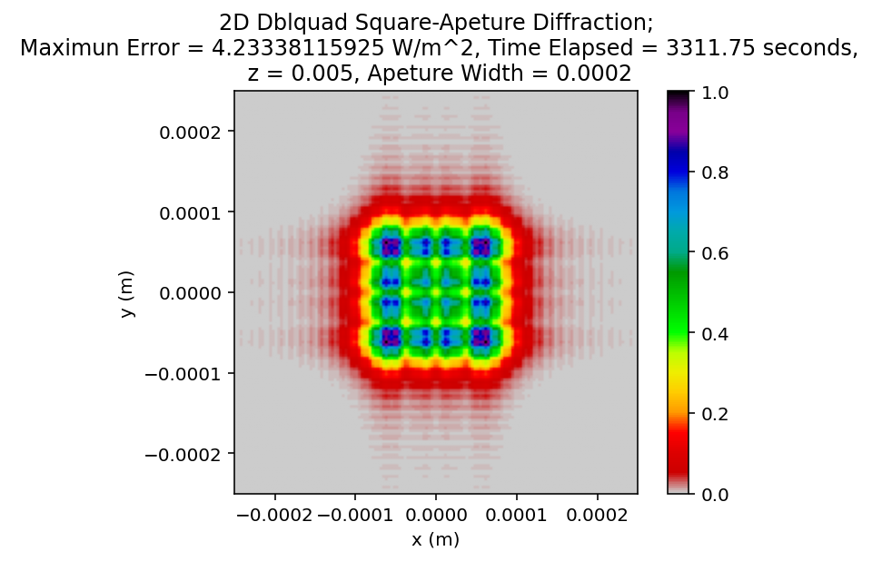

# Diffraction Simulation

This project simulates diffraction through an aperture using scipy's dblquad and Monte Carlo. Results are visualised using matplotlib, by plotting position against intensity for 1d, and including an intensity colour gradient for 2d.

## Requirements
- Python 3.x
- numpy
- scipy
- matplotlib
- sys
- time

## How to use
1. Run `diffraction_coursework_ii24784.py`.
2. Choose between Fresnel (0.005m) and Fraunhofer (0.05m)
3. Select one of 4 options, with varying dimensions, aperture shapes, and simulation methods
4. The script will plot diffraction patterns

## Example Output

Here is an example simulation of one lunar year for the Moon and probe:

## Features
- 1D and 2D Plots of Fresnel and Fraunhofer diffraction patterns
- Can select between circular and square aperture shapes
- -Can select between dblquad and Monte-Carlo for a 2d circular aperture
- Interactive menu for the above
- Automatically records time taken for each simulation

## Author
James Barnes – Physics Student, University of Bristol
